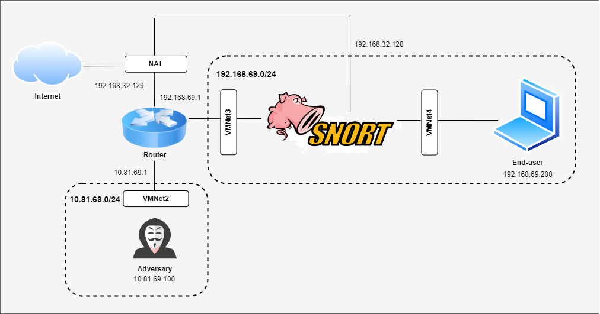
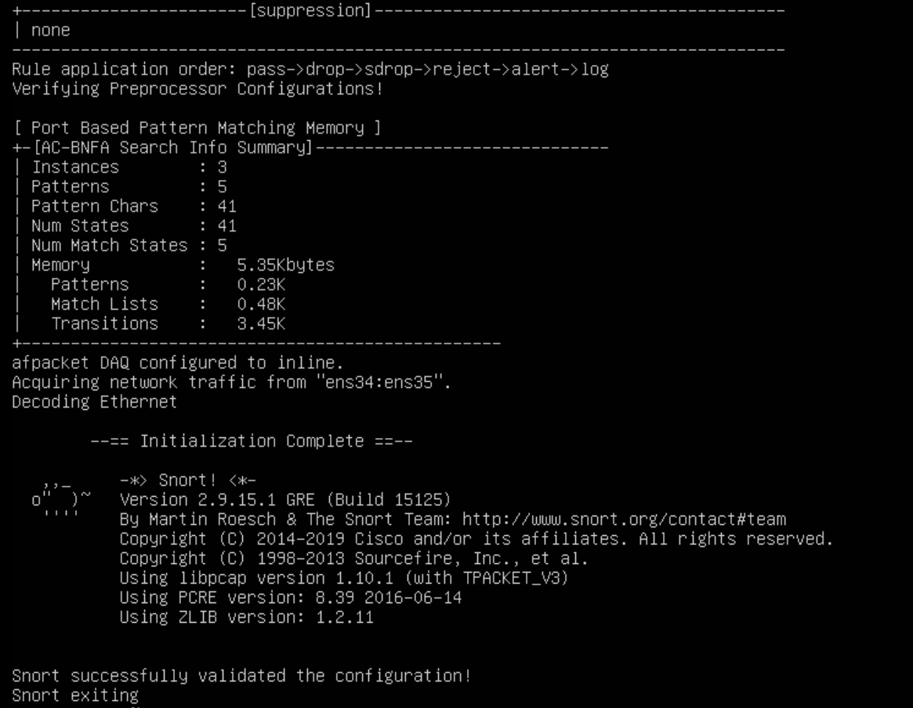

## 1. Introduction

> "An intrusion detection and prevention system (IDPS) is a solution that monitors a network for threats and then takes action to stop any threats that are detected." - [Red Hat](https://www.redhat.com/en/topics/security/what-is-an-IDPS#:~:text=An%20intrusion%20detection%20and%20prevention%20system%20(IDPS)%20is%20a%20solution,any%20threats%20that%20are%20detected.) 

Snort is one of the most widely adopted open-source network IDPS available today. Developed by Martin Roesch in 1998 and now maintained by Cisco Systems, Snort operates by analyzing network traffic to detect and prevent malicious activities. It uses a robust rule-driven language that combines the benefits of signature, protocol, and anomaly-based inspection methods, making it incredibly flexible and adaptable to different security needs. 

As an IDPS, Snort's capabilities are extensive. It can perform packet logging and analysis, monitor network traffic in real time, and react to threats it detects based on predefined rules. One of Snort's significant advantages is its inline mode functionality, where it can intercept and analyze packets as they pass through the network, acting effectively to block malicious traffic immediately—a critical capability for preventing potential damage.

The primary aim of this blog is to equip the knowledge and steps necessary to set up Snort in its inline mode. 

## 2. Prerequisites
- VMWare Workstation
- 1 Metasploitable2 VM as End-user
- 1 Kali Linux as Adversary
- 2 Ubuntu (Server) VM, 1 as Router, 1 as IDPS (Snort)

## 3. Architecture


## 4. Network Configuration
For network configuration, check out this tutorial on [How to use VMWare Network Editor](https://knowledge.broadcom.com/external/article/339371/using-the-virtual-network-editor-in-vmwa.html)
with VMNet2, 3, 4 are Custom Network.

About adding more Network Adapter in VMWare, check out this [tutorial.](https://docs.vmware.com/en/VMware-Remote-Console/12.0/com.vmware.vmrc.vsphere.doc/GUID-6C47564D-C1E0-4803-B14D-8AF13F15269E.html)

I prefer setup Static IP for every instances in the architecture. Using DHCP is optional in this situation.

For router, we need to configurate NAT outbound to work with the architecture data flow, this is my setup for a NORMAL Router, just for reference purpose with ens33 is NAT interface, ens34 is the interface connected to adversary, and ens35 is the interface connect with Snort. Extra tutorial can be found [here.](https://www.howtoforge.com/nat_iptables)

```sh
-P INPUT ACCEPT
-P FORWARD ACCEPT
-P OUTPUT ACCEPT
-A INPUT -i lo -j ACCEPT
-A INPUT -i lo -j ACCEPT
-A INPUT -m conntrack --ctstate RELATED,ESTABLISHED -j ACCEPT
-A INPUT -i ens34 -j ACCEPT
-A INPUT -i ens35 -j ACCEPT
-A FORWARD -i ens34 -j ACCEPT
-A FORWARD -o ens34 -j ACCEPT
-A FORWARD -i ens35 -j ACCEPT
-A FORWARD -o ens35 -j ACCEPT
-A FORWARD -i ens34 -m state --state RELATED,ESTABLISHED -j ACCEPT
-A FORWARD -o ens34 -m state --state RELATED,ESTABLISHED -j ACCEPT
-A FORWARD -i ens35 -m state --state RELATED,ESTABLISHED -j ACCEPT
-A FORWARD -o ens35 -m state --state RELATED,ESTABLISHED -j ACCEPT
-A FORWARD -i ens34 -o ens33 -j ACCEPT
-A FORWARD -i ens35 -o ens33 -j ACCEPT
-A FORWARD -i ens34 -o ens35 -j ACCEPT
-A FORWARD -i ens35 -o ens34 -j ACCEPT
-A FORWARD -i ens34 -o ens35 -m state --state RELATED,ESTABLISHED -j ACCEPT
-A FORWARD -i ens35 -o ens34 -m state --state RELATED,ESTABLISHED -j ACCEPT
```

## 5. Installation of Snort
There are many ways to install Snort on Linux, especially on Ubuntu, checkout the tutorial [here](https://linuxier.com/how-to-install-snort-on-ubuntu/)

## 6. Configuring Snort for Inline Mode
Ensure that the afpacket DAQ is installed to be able to use inline mode using command:
```sh
snort --daq-list
```
The output should be something like below.
```
Available DAQ modules:
pcap(v3): readback live multi unpriv
nfq(v7?): live inline multi
ipfw(v3): live inline multi unpriv
dump(v3): readback live inline multi unpriv
afpacket(v5): live inline multi unpriv
```
There are default rules package when installing Snort but for further purpose, I suggest (optional) delete it  using:
```sh
rm -rf /etc/snort/rules/*
```
The configuration based on what system actually need, so again, for reference, this is my setup for snort.conf. Make sure to create new rule file after delete the default rules, for this example, nhom2.rules is the rules file.

```
# The Stream5 preprocessor handles TCP and UDP stream reassembly. 
# track_tcp yes: Enable tracking of TCP connections.
#track_udp yes: Enable tracking of UDP packets.
#track_icmp no: Disable tracking of ICMP packets.
#max_tcp 262144: Maximum number of concurrent TCP sessions.
#max_udp 131072: Maximum number of concurrent UDP sessions.
#max_active_responses 2: Maximum number of active response packets to be sent per second.
#min_response_seconds 5: Minimum number of seconds between active responses.

preprocessor stream5_global: track_tcp yes, \
track_udp yes, \
track_icmp no, \
max_tcp 262144, \
max_udp 131072, \
max_active_responses 2, \
min_response_seconds 5

#policy windows: Assume a Windows TCP stack for reassembly.
#detect_anomalies: Enable detection of anomalous behavior.
#require_3whs 180: Require a three-way handshake within 180 seconds.
#overlap_limit 10: Maximum number of overlapping fragments.
#small_segments 3 bytes 150: Treat TCP segments smaller than 150 bytes as anomalies after seeing 3.
#timeout 30: Session timeout in seconds.
#ports client: List of ports to track for client-side connections.
#ports both: List of ports to track for both client and server connections.

preprocessor stream5_tcp: policy windows, detect_anomalies, require_3whs 180, \
overlap_limit 10, small_segments 3 bytes 150, timeout 30, \
ports client 21 22 23 25 42 79 110 111 113 119 135 136 \
137 139 143 161 445 513 514 993 995, \
ports both 80 81 443 465 563 591 593 631 636 989 992 993 995 \
311 383 591 631 636 801 808 818 901 989 992 993 995 3128 3306 \
3389 4000 4343 6000 6665 6666 6667 6668 6669 7000 8180 8888 32768 49152

# The HTTP Inspect preprocessor is used to normalize and analyze HTTP traffic. It can be configured globally and for specific servers.
# iis_unicode_map unicode.map 1252: Map Unicode characters using the specified file and codepage.
# compress_depth 65535: Maximum depth for HTTP compression.
# decompress_depth 65535: Maximum depth for HTTP decompression.
# profile all ports { 80 443 }: Apply the HTTP Inspect profile to ports 80 and 443.
# oversize_dir_length 500: Maximum length for directories before being considered oversize.
# no_alerts: Do not generate alerts for oversize directories.

preprocessor http_inspect: global iis_unicode_map unicode.map 1252 compress_depth 65535 decompress_depth 65535

preprocessor http_inspect_server: server default \
profile all ports { 80 443 } oversize_dir_length 500 no_alerts

# daq: afpacket: Use the AFPacket DAQ module for packet I/O.
# daq_mode: inline: Run Snort in inline mode, allowing it to modify traffic.

config daq: afpacket
config daq_mode: inline

# include /etc/snort/rules/nhom2.rules: Include the rules defined in the specified file.

include /etc/snort/rules/nhom2.rules
```
Checking the configuration using below command with ens34, ens35 is the network interfaces for inline mode.
```sh
snort -T -c /etc/snort/nhom2-snort.conf -Q -i ens34:ens35
```
The output should be something like below.


## 7. Conclusion
All done! That's how I use Snort for inline mode IDPS. All the step include: Network Configuration, Installation of Snort and Configuring Snort for Inline Mode. [Next blog]() will show step by step on writing Snort rules. Thanks for reading.

## 8. References
[[1] Red Hat - What is an intrusion detection and prevention system (IDPS)?](https://www.redhat.com/en/topics/security/what-is-an-IDPS#:~:text=An%20intrusion%20detection%20and%20prevention%20system%20(IDPS)%20is%20a%20solution,any%20threats%20that%20are%20detected.) 

[[2] BroadCom Articles - How to use VMWare Network Editor.](https://knowledge.broadcom.com/external/article/339371/using-the-virtual-network-editor-in-vmwa.html)

[[3] VMWare docs - Adding Network Adapter in VMWare.](https://docs.vmware.com/en/VMware-Remote-Console/12.0/com.vmware.vmrc.vsphere.doc/GUID-6C47564D-C1E0-4803-B14D-8AF13F15269E.html)

[[4] Ojash, Akshat - 7 ways to install snort on Ubuntu.](https://linuxier.com/how-to-install-snort-on-ubuntu/)

[[5] Howtoforge - Step-By-Step Configuration of NAT with iptables.](https://www.howtoforge.com/nat_iptables)
